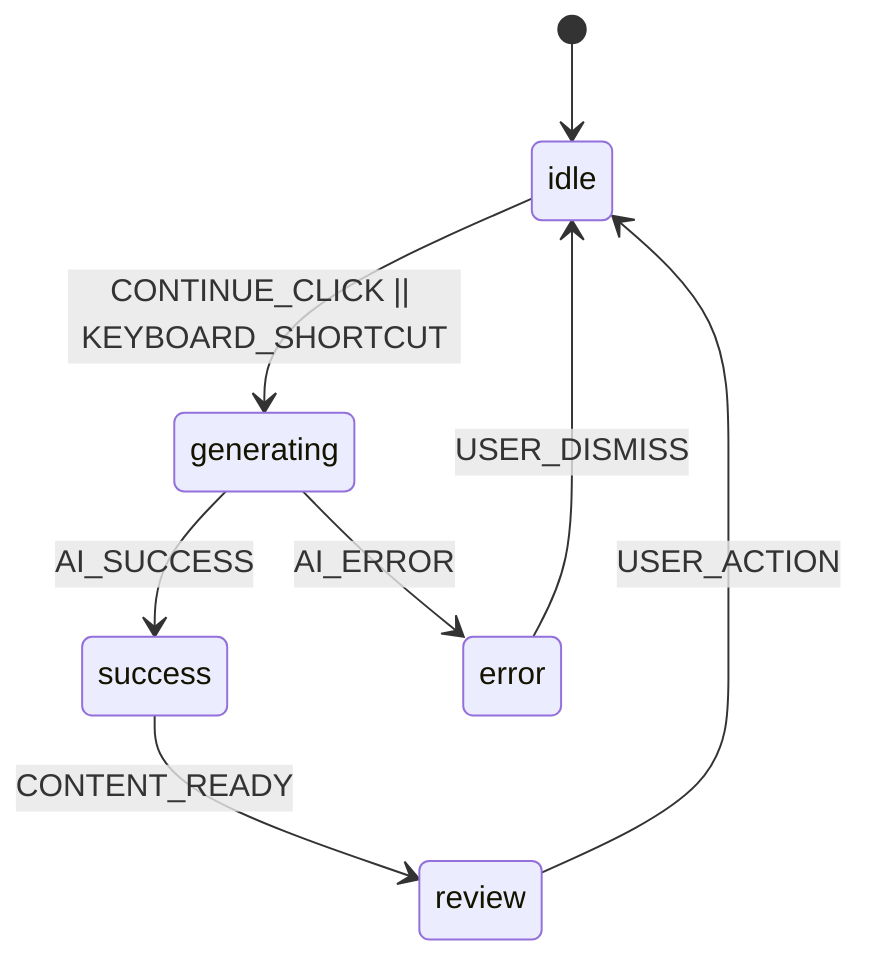

# AI Writing Assistant: Product Requirements

## Executive Summary

Build an intuitive writing assistant that seamlessly continues user content with AI-powered suggestions, robust state management, and granular content controls.

## Core Components

1. **Intelligent Writing Continuation**
2. **Seamless User Experience**
3. **Robust Technical Foundation**

## Detailed Requirements

### 1. Intelligent Writing Continuation

- **AI Content Generation**:
  - Trigger via button click or keyboard shortcut
  - Seamless insertion at cursor position
  - Loading state during processing
- **Content Management**:
  - `Accept All`: Permanent incorporation
  - `Clear All`: Remove AI-generated content
  - `Discard Session`: Revert to pre-AI state
  - Selective manual editing
- **Visual Indicators**:
  - Highlighted AI-generated text
  - Contextual action toolbar

### 2. Seamless User Experience

- **Keyboard Controls**:
  - Default: `Ctrl+Space` (Win/Linux), `Cmd+Space` (macOS)
  - Configurable shortcuts
- **State-Aware Editing**:
  - Disable input during AI processing
  - Overlay spinner during generation
  - Auto re-enable after user action
- **UI Components**:
  - Clean toolbar with primary action
  - Status indicators
  - Responsive layout

### 3. Robust Technical Foundation

- **Tech Stack**:
  - React 18 (Functional Components + Hooks)
  - XState v5 (State management)
  - ProseMirror (Editor core)
  - **Radix UI** (Accessible UI primitives)
  - Tailwind CSS (Styling)
  - Vite (Build tool)
- **AI Integration**:
  - OpenAI GPT-4 API (primary)
  - Local LLM fallback (transformers.js)
- **State Management**:

gantt
title Development Timeline
dateFormat YYYY-MM-DD
section Core Functionality
Editor Setup :2025-10-03, 3d
AI Integration :2025-10-06, 4d
State Machine :2025-10-10, 3d

section User Controls
Content Mgmt :2025-10-13, 4d
Keyboard Shortcuts:2025-10-17, 2d
Editing Restrict :2025-10-19, 2d

section Enhancements
History System :2025-10-21, 3d
AI Configuration :2025-10-24, 2d
Export Options :2025-10-26, 3d

# Implementation

sequenceDiagram
participant App
participant Toolbar
participant Editor
participant StateMachine
participant AIService

App->>Toolbar: Render
Toolbar->>StateMachine: CONTINUE_CLICK
StateMachine->>Editor: Disable editing
StateMachine->>AIService: generateContent()
AIService->>StateMachine: Return generated text
StateMachine->>Editor: Apply generated content
Editor->>StateMachine: CONTENT_READY
StateMachine->>Editor: Show review toolbar
Editor->>StateMachine: USER_ACCEPT
StateMachine->>Editor: Finalize content
